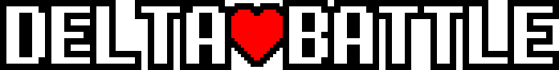

	

# About
This is a remake of Deltarune's battle system in Godot 4 that I've been working on for the past few weeks. Its still missing some important features like magic and better animations, but I plan to add some of those soon. Feel free to open any issues or pull requests, I should be able to get to them fairly quickly.

# Links
I made this project mainly for this video (which explains what decisions I made and what I learned along the way): https://youtu.be/nn1hcuoIIsw.

If you're not sure whether you want to use this system yet, I've exported a basic demo scene out to itch.io that you can play right in your browser: https://devpoodle.itch.io/delta-battle.

# Setting up
If you'd like to set up this project yourself, you should just be able to download the git repository and run it in Godot 4.4. The only thing that will require some work is the sound system. In order to reduce the size of the repository, I haven't included the sound effects directly in the project. If you want to use Deltarune's default sound effects, you have to download them from a source like this: https://www.sounds-resource.com/pc_computer/deltarune/sound/17330/, and put them all in globals/sounds/sound_effects folder. Inside of that folder, you can have any folder structure you want, the Sounds autoload reads all of the files in there, even if they're in subfolders. (If you use the provided link to download the sounds, make sure to delete snd_firstsound_donotmove.wav and snd_firstsound_donotmove2.wav. They're corrupted for some reason and will cause errors if you don't get rid of them.)
